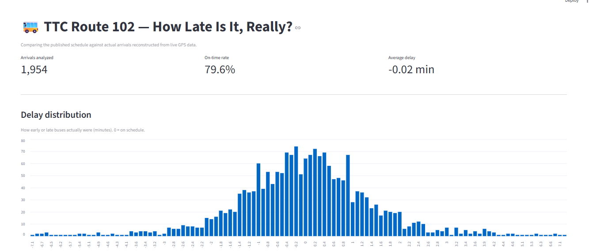
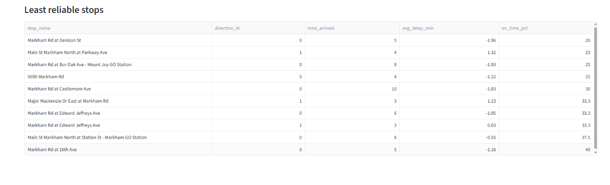
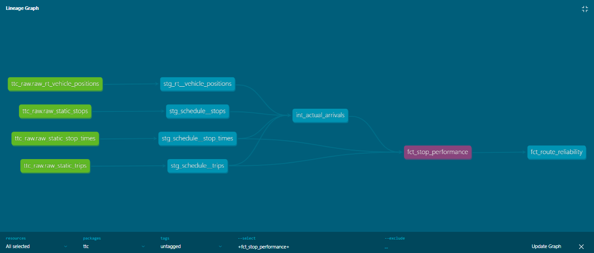
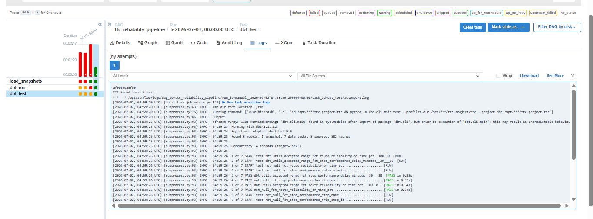

# TTC Transit Reliability Pipeline

How late is your bus, really?

The TTC publishes a schedule (when each bus *should* reach each stop) and a live GPS feed (where every bus is right now). But nothing in either feed tells you when a bus *actually arrived* somewhere  that truth has to be reconstructed. This project does that: it accumulates live GPS over time, works out when buses actually reached their stops, compares that against the published schedule, and turns the result into reliability metrics for a real Toronto bus route.

Built end to end: ingestion, warehouse, transformation, testing, a dashboard, and orchestration  using route 102 (Markham Rd) as the working example.

---

## The headline result

Across 1,954 reconstructed arrivals, route 102 runs **on-time 79.6%** of the time. The average delay is essentially zero but that's because early and late arrivals roughly cancel out, not because every bus is punctual. Around one in five arrivals still falls outside the on-time window.

The more interesting finding is *where* it breaks down. The least reliable stops cluster at the route's **northern terminus** (Denison St, Bur Oak, Castlemore, Major Mackenzie, Markham GO), where buses tend to run **early**. Early-running is a genuine reliability failure that on-time-percentage alone can hide: you can't catch a bus that already left.





---

## Why this is harder than it looks

The realtime feed reports vehicle *positions*, not *arrivals*. So the core of the project is reconstruction: for each GPS ping, measure its distance to every stop on the route, and when a bus comes within 50 metres of a stop, treat that moment as an arrival. A stream of GPS dots becomes a set of real arrival events.

Then a second problem: the realtime feed and the schedule use different `trip_id` systems, so they don't join directly. Matching each actual arrival to the *nearest scheduled time at the same stop* solves it which is also how transit agencies actually measure schedule adherence.

---

## Architecture

```
  LIVE GPS FEED                         STATIC SCHEDULE (GTFS)
  (TTC, protobuf, 30s cadence)         (published, 6-week cadence)
        |                                     |
        v                                     v
  pull_rt.py  -->  raw JSON snapshots    load_static_gtfs.py
        |                                     |
        v                                     v
  raw_rt_vehicle_positions          raw_static_{routes,trips,stops,stop_times}
        |                                     |
        |  (dbt: staging)                     |  (dbt: staging)
        v                                     v
  stg_rt__vehicle_positions          stg_schedule__*
        \                                   /
         \                                 /
          v                               v
              int_actual_arrivals    (reconstruct arrivals from GPS proximity)
                        |
                        v
              fct_stop_performance   (match to schedule -> compute delay)
                        |
                        v
              fct_route_reliability  (aggregate -> on-time %, avg delay)
                        |
                        v
                  dashboard  +  Airflow-orchestrated runs
```



---

## Stack

| Layer | Tool | Why |
|---|---|---|
| Ingestion | Python (requests, gtfs-realtime-bindings) | Polls the live feed; decodes protobuf GPS |
| Warehouse | DuckDB | Free, local, columnar — same paradigm as Snowflake/BigQuery |
| Transformation | dbt | Layered models (staging → intermediate → marts), with tests, docs, snapshots |
| Dashboard | Streamlit | Interactive, pure-Python |
| Orchestration | Apache Airflow (Docker) | Scheduled, ordered, monitored pipeline runs |

---

## What it demonstrates

- **Reconstructed data, not a clean dataset.** Actual arrivals are inferred from raw GPS geometry, not read from a feed.
- **Layered dbt modelling**: staging (clean, 1:1), intermediate (the reconstruction logic), marts (delay and aggregation).
- **Incremental materialization**: the fact table appends only new arrivals as data grows, instead of rebuilding.
- **Automated data-quality tests**:dbt tests (`not_null`, `unique`, `accepted_range`) catch bad data on every run, including the impossible-delay values found during development.
- **SCD Type 2 snapshot**: captures schedule changes over time (the TTC republishes every 6 weeks).
- **Direction-aware analysis**: northbound and southbound reliability measured separately.
- **Orchestration**: an Airflow DAG runs load → transform → test in order, on a schedule, with retries.



---

## Engineering decisions worth noting

- **Arrival detection by proximity.** A bus within ~50 m of a stop counts as arrived. The threshold is documented and validated against sample data, because a wrong rule silently corrupts every downstream metric.
- **Schedule/realtime IDs don't reconcile**, so arrivals are matched to the nearest scheduled time at the same stop rather than by `trip_id`.
- **Outlier guarding.** Matches more than 30 minutes off are discarded as mismatched trips, which kept impossible values (e.g. −83 min) out of the metrics.
- **Out-of-service hours handled correctly.** Buses running outside scheduled service have no schedule to match against and are excluded rather than producing garbage delays.
- **Batch loading.** Loading three hours of data (722k rows) initially ran out of memory; the loader was refactored to process files in batches.
- **LocalExecutor over CeleryExecutor** for Airflow, a deliberate choice for a single-machine setup on limited RAM.

---

## Running it

```
pip install -r requirements.txt

# 1. Download the TTC GTFS schedule and unzip into data/gtfs_static/
#    https://open.toronto.ca/dataset/ttc-routes-and-schedules/

# 2. Load the schedule
python scripts/load_static_gtfs.py

# 3. Collect live GPS (runs a polling loop)
python scripts/pull_rt.py

# 4. Load the collected snapshots
python scripts/load_rt_snapshots.py

# 5. Build and test the pipeline
cd ttc
dbt run
dbt test

# 6. Launch the dashboard (from the project root)
streamlit run dashboard.py
```

Airflow (optional, for orchestration) lives in `airflow/` and runs via Docker Compose.

---

## Data and licensing

Schedule and realtime data from City of Toronto Open Data / TTC, under the Open Government Licence – Toronto. This project contains information licensed under the Open Government Licence – Toronto.

---

## Roadmap

- Parameterize the route via a dbt variable
- Scale from route 102 to all TTC routes — a city-wide reliability map
- Swap DuckDB for a cloud warehouse (Snowflake / BigQuery) — a near-trivial dbt profile change
